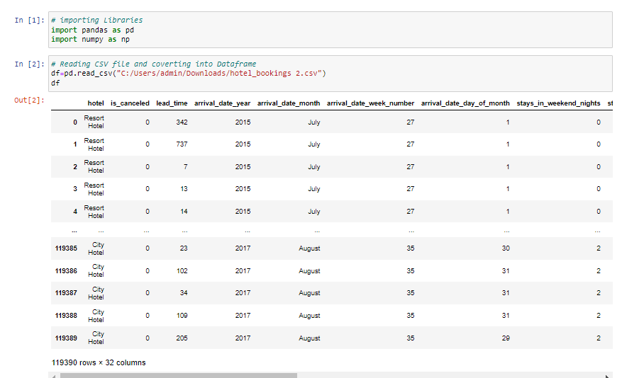
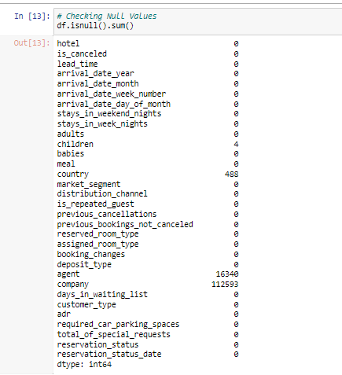
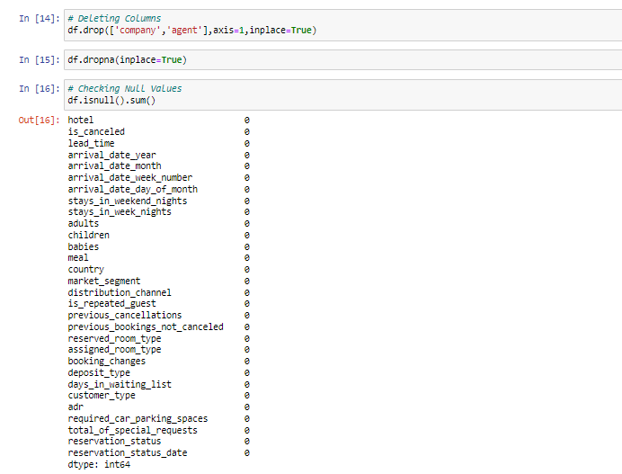
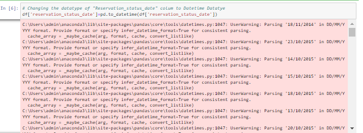
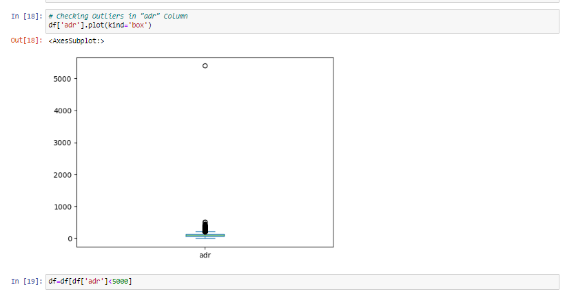
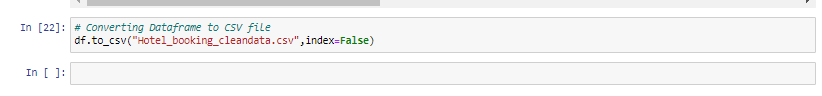
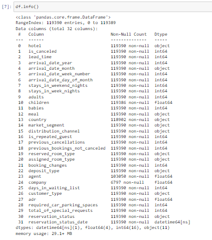
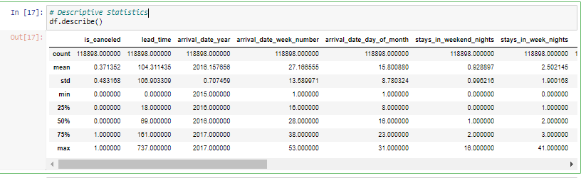
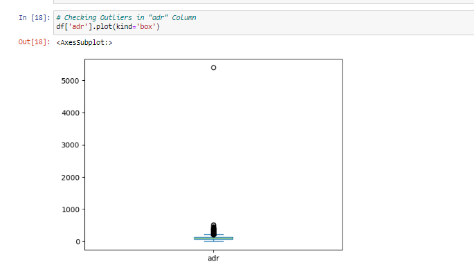
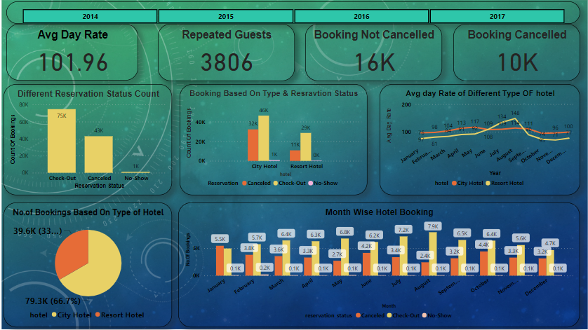

# Hotel_booking_analysis
# Project Overview
This project is a hotel booking system developed using Python's Pandas library for efficient data manipulation. It aims to optimize the hotel booking process and drive business growth by extracting actionable insights and implementing data-driven solutions. The project also includes a Power BI dashboard that highlights key performance indicators (KPIs) to monitor and analyze the hotel's performance.

# Objective
The objective of this project is to analyze hotel booking data and extract actionable insights to optimize the hotel booking process.

# Data Preprocessing
  In this project, we conducted extensive data preprocessing to ensure the quality and integrity of our hotel booking dataset. Data preprocessing is a crucial step in any data analysis project as it helps us clean, organize, and structure the data for effective analysis and modeling. Below, we outline the key data preprocessing steps performed:
1. Data Loading: We started by loading the raw data into our Python environment using libraries like pandas. This step allowed us to access and manipulate the data for further processing.

2. Handling Missing Values: We identified and addressed missing values in the dataset. This included strategies such as imputation (filling missing values with meaningful data) or removal of rows/columns with excessive missing data, depending on the nature of the data and the analysis requirements.

3. Data Cleaning: We cleaned the data by addressing any inconsistencies, outliers, or errors. This included standardizing data formats, correcting typos, and removing duplicate records to ensure data accuracy.

4. Data Saving: After preprocessing, we saved the cleaned and transformed data into a separate file or database for easy access in subsequent stages of the project.

By following these data preprocessing steps, we ensured that our data was ready for analysis, visualization, and modeling. Clean and well-structured data is the foundation of any successful data analysis project, and it allows us to derive meaningful insights and make informed decisions.

# Data Exploration and Analysis

In this project, we conducted a comprehensive data exploration and analysis to uncover valuable insights from our hotel booking dataset. Data exploration is a crucial phase in the data analysis process, where we dive into the data to understand its characteristics, relationships, and patterns. Below, we highlight the key steps and findings from our data exploration and analysis:
1. Data Overview:
We began by gaining a high-level understanding of our dataset, including the number of records, features, and data types. This allowed us to assess the scope and complexity of our analysis.

2. Descriptive Statistics:
We calculated basic descriptive statistics such as mean, median, standard deviation, and percentiles for numeric features. This provided us with a summary of central tendencies and variability in the data.

3. Data Visualization:
To visualize the data, we created various plots and charts using libraries like Matplotlib and Seaborn. Our visualizations included:
Box Plots: to explore data distributions and identify outliers.

# Key Features
1. Efficient Data Manipulation: Utilizes Python's Pandas library for efficient data manipulation, allowing for seamless processing and analysis of hotel booking data.
2. Power BI Dashboard: Provides a visually appealing and interactive Power BI dashboard that showcases key performance indicators (KPIs) relevant to the hotel booking process. The dashboard allows stakeholders to monitor and gain insights into the hotel's performance.

# Results and Impact
Through this project, the following outcomes and impacts were achieved: Increased revenue by identifying patterns and trends in hotel booking data, allowing for strategic pricing and marketing decisions. Enhanced the hotel booking process by identifying bottlenecks and implementing improvements based on data-driven insights. Improved project performance by leveraging Python's Pandas library for efficient data manipulation and analysis.

# Technologies Used
1) Python
2) Pandas
3) Power BI

# Conclusion
In conclusion, this project shows the successful utilization of Python's Pandas library and Power BI to analyze hotel booking data and extract actionable insights. These efforts resulted in increased revenue, enhanced customer experience, and improved project performance

# Limitations and Challenges:
1. Data quality issues, including missing data and outliers, required some preprocessing.
2. Imbalanced data posed challenges for Analysis.
3. The dataset's size may not fully represent the entire population.
4. Resource constraints could impact the depth and speed of analysis.
5. The project's scope was defined by objectives and available data.

